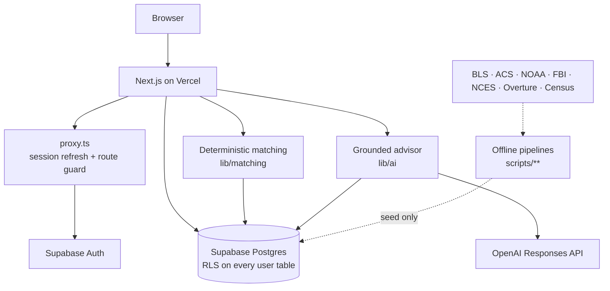

# DreamDestination

DreamDestination helps people work out which U.S. cities or metro areas fit
their circumstances — family, finances, career and lifestyle — and explains
why, rather than handing back a generic "best places to live" list.

## Current state

**Phase 3: matching works end to end.** A user can create an account, complete
onboarding, and get a deterministic, explainable ranking of U.S. metros scored
against real federal data. Every number on screen traces back to a named
dataset.

Still absent, by design:

- any LLM call, prompt or AI-generated explanation — explanations are generated
  from the arithmetic, not a model
- live job, housing or listing integrations
- learned/ML ranking; there is no outcome data to train on, so the model is
  explicit and auditable instead

### Onboarding flow

```text
/                     landing; sign up or sign in
/auth/sign-up         create account
/auth/sign-in         sign in (?redirectTo= is sanitised)
/onboarding           hub; redirects to whichever step is outstanding
/onboarding/profile   structured profile, doubles as the edit form
/onboarding/preferences  ten 0-1 priority weights, doubles as the edit form
/recommendations      ranked metros with per-dimension breakdown
```

Everything under `/onboarding` requires an authenticated user.

## Stack

| Concern         | Choice                                        |
| --------------- | --------------------------------------------- |
| Framework       | Next.js 16 (App Router, Turbopack)            |
| Language        | TypeScript 5, `strict` mode                   |
| UI              | React 19, Tailwind CSS v4, shadcn/ui          |
| Icons           | lucide-react                                  |
| Backend         | Supabase (PostgreSQL 15+) via `@supabase/ssr` |
| Auth            | Supabase email/password, cookie sessions      |
| Validation      | Zod 4                                         |
| Testing         | Vitest 4 (unit) + psql RLS smoke test         |
| Linting         | ESLint 9 + `eslint-config-next`               |
| Formatting      | Prettier 3 + `prettier-plugin-tailwindcss`    |
| Package manager | npm                                           |

Requires Node.js >= 20.9 (developed on Node 22).

## Local setup

```bash
npm install
cp .env.example .env.local
# fill in .env.local with values from your Supabase project
npm run dev
```

The app runs at http://localhost:3000.

`npm run build` works **without** Supabase credentials: every page that reads a
session is dynamic, so nothing is prerendered at build time. Running the app
does need them — the landing page and all of onboarding resolve the current
user on each request.

Environment validation is lazy: it runs when a Supabase client is first
constructed and names the missing variable, rather than silently falling back
to a default.

## Environment variables

Copy `.env.example` to `.env.local`. All values come from your Supabase project
under **Project Settings → API**.

| Variable                        | Scope      | Purpose                                                                                                                                                                                                                                |
| ------------------------------- | ---------- | -------------------------------------------------------------------------------------------------------------------------------------------------------------------------------------------------------------------------------------- |
| `NEXT_PUBLIC_SUPABASE_URL`      | Public     | Base URL of the Supabase project, e.g. `https://<project-ref>.supabase.co`. Inlined into the browser bundle.                                                                                                                           |
| `NEXT_PUBLIC_SUPABASE_ANON_KEY` | Public     | Anon key. Safe in the browser: every query it makes is constrained by Row Level Security.                                                                                                                                              |
| `SUPABASE_SERVICE_ROLE_KEY`     | **Server** | Service-role key. **Bypasses Row Level Security.** Read only by offline seed scripts — never by request-time code. Never prefix with `NEXT_PUBLIC_`.                                                                                   |
| `OPENAI_API_KEY`                | **Server** | Advisor credential. Read only in `lib/ai/`, never sent to the browser. Never prefix with `NEXT_PUBLIC_`.                                                                                                                               |
| `OPENAI_MODEL`                  | **Server** | Model id for the Responses API, e.g. `gpt-5.6-luna`.                                                                                                                                                                                   |
| `NEXT_PUBLIC_SITE_URL`          | Public     | Canonical origin, used to build the sign-up confirmation link. **Set it on Production only** — resolution keys on `VERCEL_ENV`, and Preview deliberately ignores it in favour of its own `VERCEL_URL`. Match Supabase's Auth Site URL. |

Required in every environment: the two `NEXT_PUBLIC_SUPABASE_*` values. The
advisor is optional — without `OPENAI_API_KEY` the app runs and the advisor
reports itself unconfigured rather than failing. `SUPABASE_SERVICE_ROLE_KEY` is
needed only to seed a database, not to serve requests, so it does **not** belong
in the Vercel runtime environment.

`.env.local` is gitignored. `.env.example` is committed and contains
placeholders only — no real credentials are in version control.

## Supabase setup

1. **Create a project** at [supabase.com](https://supabase.com) and wait for it
   to finish provisioning.

2. **Apply the migration.** Either paste
   `supabase/migrations/20260814000000_initial_schema.sql` into the SQL Editor
   and run it, or use the CLI:

   ```bash
   npx supabase link --project-ref <your-project-ref>
   npx supabase db push
   ```

   The migration expects Supabase's `auth.users` table and the `anon`,
   `authenticated` and `service_role` roles, so it targets a Supabase project
   rather than a bare PostgreSQL instance.

3. **Set the environment variables** listed above in `.env.local`, and in your
   Vercel project settings for deployments.

4. **Verify Row Level Security** against your project. This script signs in as
   two synthetic users plus an anonymous visitor and asserts the whole
   ownership model. It runs in a transaction and rolls back, leaving no data:

   ```bash
   psql "$DATABASE_URL" -v ON_ERROR_STOP=1 -f supabase/tests/rls_smoke.sql
   ```

   Use the direct connection string from Project Settings → Database, not the
   pooler.

   There is a companion test that attacks the same model from _outside_ the
   database, driving the real Auth and PostgREST endpoints with real JWTs:

   ```bash
   ./supabase/tests/unauthorized_access.sh
   ```

   It signs up two throwaway users, so run it against a local stack only.

### Regenerating database types

`types/database.ts` is generated from the live schema and is checked in.
Regenerate it after any migration:

```bash
npx supabase gen types typescript --linked > types/database.ts
```

The generated file is listed in `.prettierignore` so regenerating never
produces formatting churn. Do not hand-edit it — change the migration and
regenerate.

> `supabase gen types` runs its introspector in Docker, so it needs either a
> running Docker daemon or a linked hosted project.

### Running Supabase locally

```bash
npx supabase start
```

This boots Postgres, Auth and PostgREST in Docker and prints a local URL,
anon key and service-role key to put in `.env.local`. It needs roughly 5 GB of
free disk for the container images.

## City data and matching

The ranking engine, its data sources and the exact arithmetic are documented in
[docs/matching.md](docs/matching.md). In brief: the 100 largest U.S. metros,
scored on seven metrics from Census ACS and NOAA, normalised to 0-100, weighted
by the user's own sliders, ranked deterministically and explained from the
resulting numbers — no model involved.

Regenerate the dataset (no API keys required):

```bash
npm run data:fetch
```

```bash
npm run data:transform
```

```bash
npm run data:validate
```

```bash
npm run data:seed
```

## Development commands

```bash
npm run dev
```

```bash
npm run lint
```

```bash
npm run typecheck
```

```bash
npm run test
```

```bash
npm run build
```

Also available: `npm run start` (serve the production build), `npm run
test:watch`, `npm run format` and `npm run format:check`.

`typecheck` runs `next typegen` first so that Next.js's generated route and
layout types exist before `tsc`; this keeps the command usable in CI without a
prior build.

## Architecture

```text
proxy.ts        Next.js 16 Proxy (formerly Middleware): refreshes the Supabase
                session cookie and applies optimistic redirects.
app/
  page.tsx      Landing page.
  auth/         Sign-in / sign-up pages and their server actions.
  onboarding/   Protected. layout.tsx is the authoritative auth guard.
components/
  ui/           shadcn/ui primitives plus a native <select> wrapper.
  forms/        Shared field errors, form alerts and the submit button.
lib/
  constants.ts  Closed value sets — age ranges, states, weight dimensions.
  labels.ts     Display text for those value sets.
  routes.ts     Route constants and the pure redirect rules.
  forms.ts      FormState contract and FormData readers.
  env.ts        Zod-validated environment access, split public vs. server.
  utils.ts      cn() class-name helper.
  auth/         getCurrentUser() / requireUser().
  data/         Server-only data access: profiles.ts, preferences.ts.
  mappers/      snake_case <-> camelCase boundary.
  supabase/     client.ts (browser), server.ts (RSC/actions), admin.ts (service
                role), proxy-session.ts (cookie refresh).
  validation/   Zod schemas for auth, profile, preferences and city input.
  matching/     The scoring engine: dimensions registry, normalization,
                weights, filters, scoring, ranking, explanations, service.
types/          Domain models plus generated database.ts.
scripts/
  city-data/    fetch / transform / validate / seed pipeline.
data/
  processed/    Committed canonical dataset (cities + observations).
docs/
  matching.md   Data sources, algorithm and worked example.
supabase/
  migrations/   Ordered SQL migrations.
  tests/        rls_smoke.sql and recommendations_rls.sql (in-database RLS
                assertions) and unauthorized_access.sh (attacked over HTTP).
tests/          Vitest unit tests.
```

Conventions worth knowing:

- **One direction of flow.** UI → Zod validation → server action → data-access
  layer → Supabase. Form components contain no Supabase calls.
- **Naming boundary.** TypeScript models use `camelCase`; the database uses
  `snake_case`. Every rename happens in `lib/mappers/`, nowhere else.
- **Ownership comes from the session.** Data-access functions resolve the user
  themselves via `requireUser()`; none of them accepts a user or profile id
  from a caller, so a browser-supplied `user_id` has no path into a query.
- **Single source of truth for value sets.** `lib/constants.ts` defines the
  closed sets; domain types, Zod schemas and display labels all derive from it,
  and the migration mirrors it with Postgres enums, a domain and CHECK
  constraints. The schemas and label maps use `satisfies` against the domain
  types, so drift is a compile error rather than a runtime surprise.
- **Two layers of route protection.** `proxy.ts` does an optimistic
  cookie-based redirect for speed; `app/onboarding/layout.tsx` calls
  `getUser()` on the server and is the authoritative check. Next.js's own docs
  warn that Proxy is not a substitute for real authorization.

## Security notes

- **No secrets are committed.** `.env.example` holds placeholders; `.env.local`
  is gitignored.
- **No service-role credential is used in the application at all.** The web app
  runs entirely on the anon key under RLS. Recommendations — which users may not
  author directly — are written by `replace_my_recommendations`, a
  `SECURITY DEFINER` function that derives the owner from `auth.uid()` and
  accepts no profile id, so a cross-user write cannot be expressed. The
  service-role key is read only by `scripts/city-data/seed.ts`, an offline
  developer task. `getServerEnv()` still throws if reached in a browser.
- **RLS is enabled on all five tables**, and where no policy grants an action,
  that action is denied.
  - `profiles` and `preferences`: full read/write, scoped to the owning user.
  - `recommendations`: **read-only** for users. There is deliberately no write
    policy — recommendations are derived data, and letting a client write them
    would let a user fabricate their own results. Scoring will write them
    server-side with the service-role key, which bypasses RLS.
  - `cities` and `city_metrics`: readable by everyone, writable by no one.
    Ingestion will run with the service-role key.
- **Normal user flows never touch the service-role key.** Creating and editing
  a profile and preferences all run as the signed-in user through the anon key,
  with RLS as the enforcement boundary. `lib/supabase/admin.ts` exists for
  future trusted server work and is currently used by nothing.
- **Passwords are never echoed back.** A rejected form re-populates its fields
  from the server so the user does not retype everything, but the values sent
  back deliberately exclude password fields.
- **`?redirectTo=` is sanitised** to root-relative in-app paths, so the sign-in
  form cannot be turned into an open redirect.
- **Baseline response headers** (`X-Content-Type-Options`, `X-Frame-Options`,
  `Referrer-Policy`, `Permissions-Policy`) are set in `next.config.ts`. There is
  no Content-Security-Policy yet — a permissive placeholder would look like
  protection without being any.

## Deployment

`vercel.json` pins the framework, install command, build command and region.

### Production architecture



The request path touches Supabase and, for the advisor only, OpenAI. It never
reads the filesystem, never calls a places API, and never uses the service-role
key. Every dataset reaches production through the database, not the bundle.

### One-time production setup

1. **Create a Supabase project** (dashboard). Note the project ref.
2. **Apply migrations.** With the Supabase CLI:
   `supabase link --project-ref <ref>` then `supabase db push`.
   Migrations in `supabase/migrations/` are the only source of schema truth.
3. **Seed reference data** against the new project:
   ```bash
   NEXT_PUBLIC_SUPABASE_URL=https://<ref>.supabase.co \
   SUPABASE_SERVICE_ROLE_KEY=<service-role-key> \
   npm run data:bootstrap
   ```
   This runs all seven seeds in dependency order and then asserts row counts,
   so a partial seed fails loudly instead of silently degrading everyone's
   recommendations. It only ever writes canonical reference tables — it cannot
   touch `profiles`, `preferences`, `recommendations` or advisor data.
   Re-verify at any time with `npm run data:bootstrap:verify`.
4. **Configure Supabase Auth** → URL Configuration:
   - Site URL: the exact production origin, e.g. `https://dreamdestination.example`
   - Redirect URLs: that origin's `/onboarding`, plus the Vercel preview
     wildcard if preview deployments need sign-up. Avoid a wildcard on the
     production domain.

   Supabase documents the preview wildcard as
   `https://*-<team-or-account-slug>.vercel.app/**`. The wildcard goes on the
   **left**, because a Vercel preview hostname is
   `<project>-<hash>-<team-slug>.vercel.app` — the part that varies per
   deployment is the prefix, and the team slug is the stable suffix. A
   prefix-anchored pattern like `https://<project>-*.vercel.app/**` does not
   match and will silently reject every preview sign-up.

   For this project that is:

   ```
   https://*-briansmith01cs-7446.vercel.app/**
   ```

   The preview wildcard is required rather than optional: preview URLs are
   generated per deployment, and `lib/site-url.ts` resolves a preview to its own
   `VERCEL_URL` precisely so a tester's confirmation email does not send them to
   production. Without the wildcard, Supabase rejects that redirect.

5. **Configure Vercel environment variables** per environment. Production and
   Preview should point at different Supabase projects where practical; do not
   copy production secrets into Preview.
6. **Deploy a Preview first**, smoke-test it, then promote to Production.

### Data bootstrap and the career artefact

Every seed reads from `data/processed/`, which is committed. Nothing in
production needs `data/raw/`, which is deliberately not in the repository.

One exception is worth knowing about: `career-stats.json` is a 12 MB build
artefact and stays gitignored, but the gzipped copy beside it
(`career-stats.json.gz`, 1.3 MB) **is** committed and the seed falls back to it.
That asymmetry exists because BLS serves `oesm25ma.zip` only to a browser and
blocks automated clients, so a fresh clone has no way to regenerate the JSON.
Without the committed gzip, career data could not be seeded at all and every
user would silently fall back to the metro-wide labour market.

## Next milestone

Every priority onboarding collects is now scored. The ranking itself should stay
deterministic and auditable.

Social/lifestyle is scored as of Phase 6C, from Overture Maps place counts
joined to official Census CBSA boundaries by point-in-polygon, with optional
lifestyle-category preferences. Place counts measure availability and breadth —
never quality, popularity or walkability.

What ships here is DreamDestination-derived aggregate metro/category statistics
built from the Overture Places release, not the underlying records. Places
aggregates upstream sources under mixed licensing — CDLA Permissive 2.0,
Apache 2.0 (Foursquare) and CC0 1.0 — documented at
[Overture's attribution page](https://docs.overturemaps.org/attribution/).
Citation: Overture Maps Foundation, overturemaps.org.

Safety and family friendliness are scored as of Phase 6B, from FBI CIUS 2025
metro crime rates and NCES public-school counts against the ACS school-age
population. See [docs/matching.md](docs/matching.md) for what each does and does
not measure — in particular, metro crime rates say nothing about neighbourhood
or personal safety, and school counts measure availability, not quality.
